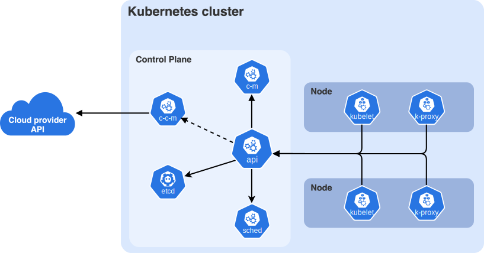

# Deploying NOMAD Oasis with Kubernetes

## FAIRmat Users Meeting

Lauri Himanen, Technical Coordinator at FAIRmat

16/06/2026

<style>
h1 { font-size: 3rem !important; line-height: 1.12 !important; }
</style>

<!--
Welcome. This is a hands-on workshop: ~45 min of slides, ~45 min of live demoing, and ~30 min for debugging and questions at the end.

Goal: by the end you should understand *why* and *how* you would move a NOMAD Oasis from Docker Compose to Kubernetes, and be able to reproduce a deployment yourself — locally on your laptop and in the cloud.
-->

---
hideInToc: true
---

# Overview
<Toc text-2xl minDepth="1" maxDepth="1" />

---
layout: two-cols-header
level: 2
---

# View slides on your laptop

::left::

Open the live version of these slides on your own device — **scan the QR code** or type the short link.

This way you can:

- Follow along at your **own pace**
- **Copy & paste** the commands directly

::right::

<div class="h-full flex flex-col items-center justify-center gap-6">
  
  <a href="https://tinyurl.com/3rj4xajc" class="text-3xl font-bold no-underline">
    tinyurl.com/3rj4xajc
  </a>
</div>

---
layout: section
---

# Why Kubernetes?

---
layout: two-cols-header
level: 2
---

# Docker Compose

::left:: 

Most Oasis installations run with a single **`docker compose up`**:

- One host, one command: easy to reason about
- Great for laptops, single servers, small groups
- **nomad-distro-template** ships a ready `docker-compose.yaml`

Where it starts to strain:

- Everything lives on **one machine** = only vertical scaling
- **No self-healing**: a crashed container stays down until you act
- Scaling workers or NORTH means **editing the file and restarting**

::right::

<div class="h-full flex flex-col justify-center">
  <div class="flex justify-center">
    
  </div>
</div>

<style>
.slidev-layout.two-cols-header {
  grid-template-columns: 60% 40%;
}
</style>

<!--
This is the architecture almost every Oasis admin already knows. The point of today is not that Compose is bad — it is excellent for getting started. The point is what happens when a single machine is no longer enough.
-->

---
layout: two-cols-header
level: 2
---

# Kubernetes

::left:: 

Kubernetes runs the **same containers**, but as a self-managing system across a cluster of machines:

- You declare the **desired state**; Kubernetes keeps reality matching it
- One Helm command deploys the **whole NOMAD stack**
- Same workflow on a **laptop** or **many cloud nodes**

Where Compose strained, Kubernetes helps:

- **Self-healing**: crashed containers are restarted automatically
- **Scaling**: spread replicas across **many machines**
- **Rolling updates** & one-command rollback — no downtime

::right::

<div class="h-full flex flex-col justify-center">
  <div class="flex justify-center">
    
  </div>

</div>

<style>
.slidev-layout.two-cols-header {
  grid-template-columns: 60% 40%;
}
</style>

<!--
The counterpart to the previous slide: the same NOMAD containers, but now a cluster runs them for you. Keep it high-level here — the anatomy (pods, nodes, control plane) gets its own slide in the history section. The one idea to land: you describe the desired state, and Kubernetes makes it real and keeps it that way. Each bullet in the second group answers a pain point from the Compose slide.
-->

---
level: 2
---

# Docker Compose vs. Kubernetes

|  | **Docker Compose** | **Kubernetes** |
| --- | --- | --- |
| **Scope** | Single host | Multi-node cluster |
| **Scaling** | Manual (`--scale`) | Autoscaling (HPA), across nodes |
| **Self-healing** | None | Restarts & reschedules failed pods |
| **Updates** | Manual restart | Rolling updates + one-command rollback |
| **Learning curve** | Gentle | Steep |
| **Overhead** | Minimal | Control plane + per-node agents |
| **Best for** | Dev, single server | Production, HA, many concurrent users |

A common path: **start on Docker Compose, grow into Kubernetes** — the same container image works on both.

<style>
table th, table td { padding: 7px 10px !important; line-height: 1.25 !important; }
</style>

<!--
Walk the table row by row. Emphasise the last row: the application doesn't change, the *orchestrator* does. That's why your NOMAD image is identical in both worlds. Land the closing line: most installs start on Compose and only grow into Kubernetes when a single machine is no longer enough.
-->

---
layout: section
---

# A bit of Kubernetes history

---
layout: two-cols-header
level: 2
---

# Where Kubernetes comes from

::left:: 

<v-clicks>

- **Google Borg**: an in-house system that scheduled containers across Google's data centers since the early 2000s. Battle-tested at planet scale long before "containers" went mainstream.
- In **2014**, Kubernetes was born as an open-source rewrite — **announced 6 June 2014**, written in **Go** (Borg was C++).
- **v1.0** shipped in **July 2015**, and Google handed the project to the brand-new **Cloud Native Computing Foundation (CNCF)** as its seed project: so **no single vendor owns it**.
- A huge community has since made it the **de-facto standard for container orchestration**, from start-ups to research data centres.

</v-clicks>

::right::

<div class="h-full flex flex-col justify-center ml-8">
  <div class="text-[0.82rem] px-3 py-2 rounded border border-gray-400/40 mb-20">

  **What's in a name?** *Kubernetes* is Greek (κυβερνήτης) for **helmsman / pilot** — the same root as *cybernetics* and *governor*. Often shortened to **K8s** (K + 8 letters + s). Its **seven-spoked ship's-wheel** logo nods to the team's codename, *"Project Seven of Nine"* — a Star Trek Borg reference.
  </div>
</div>

<style>
.slidev-layout.two-cols-header {
  grid-template-columns: 55% 45%; /* Adjust to your desired proportions */
}
</style>

<!--
The one-liner: you describe the state you want ("3 replicas of the worker, this much memory"), and Kubernetes continuously works to make reality match that description. Borg ran Google for over a decade before Kubernetes existed — this is battle-tested thinking, not a science project.

Two things worth emphasising: (1) it's vendor-neutral — donated to the CNCF, which is why every cloud offers it; (2) the "helmsman" etymology and the ship's-wheel logo set up the next section nicely — Helm, the package manager, is literally the ship's wheel you steer the cluster with. The "Seven of Nine" trivia is a reliable chuckle.
-->

---
layout: two-cols-header
level: 2
---

# What is a Kubernetes cluster?

::left:: 

A **cluster** = a control plane that gives orders + worker nodes that run your containers.

**Control plane** (the brain):

- **api-server** — the front door, everything talks to it
- **scheduler** — decides which node runs a pod
- **etcd** — the database of cluster state
- **controller-manager** — drives reality toward desired state

**Worker nodes** (the muscle):

- **kubelet** — runs containers on the node
- **kube-proxy** — wires up networking
- a **container runtime** (e.g. containerd)

::right::

<div class="h-full flex flex-col items-center justify-center ml-4">
  
  <div class="text-[0.8rem] mt-4 self-start">

  Key objects: **Pod** (one+ containers) · **Node** (a machine) · **Service** (stable address) · **Deployment** (keeps N replicas running)

  </div>
</div>

<!--
On a managed cloud cluster you never see the control plane — the provider runs it for you. On k3s the control plane and the single worker node both live inside on your laptop.
-->

---
layout: section
---

# Helm: packaging for Kubernetes

---
layout: two-cols-header
level: 2
---

# Where Helm fits in

::left:: 

A real app like NOMAD is **dozens of Kubernetes objects** (deployments, services, config maps, secrets, volumes…).

**Helm is the package manager for Kubernetes** — think `apt` / `pip` / `conda`, but for clusters.

- **Chart** — a packaged, templated application
- **values.yaml** — the knobs you can turn
- **Release** — one installed instance in your cluster
- **Templating** — values + templates → plain manifests

That's why FAIRmat ships a **Helm chart** instead of a pile of raw YAML: one command installs the whole stack.

::right::

<div class="h-full flex flex-col items-center justify-center ml-8 gap-8 -mt-10">
  
</div>

<!--
Analogy that lands with scientists: a Helm chart is to Kubernetes what a conda package is to Python — someone has done the hard packaging work, you just pick a version and a few settings.
-->

---
layout: two-cols-header
level: 2
---

# The NOMAD Helm charts

::left:: 

Repo: [**`FAIRmat-NFDI/nomad-helm-charts`**](https://github.com/FAIRmat-NFDI/nomad-helm-charts)

- One chart: **`default`** — the full Oasis stack
- Bundles the dependencies as **subcharts** (app, worker, NORTH, MongoDB, Elasticsearch, …)
- Ready-made **`custom-values/`** for each target: `k3s.yaml`, `minikube.yaml`, `kind.yaml`, `aws.yaml`, `gke.yaml`
- **`helpers/`** scripts that bootstrap a local cluster for you

::right::

<div class="h-full flex flex-col justify-center ml-8">

```text
nomad-helm-charts/
├── charts/
│   └── default/
│       ├── Chart.yaml
│       ├── values.yaml
│       └── custom-values/
│           ├── k3s.yaml
│           ├── kind.yaml
│           ├── minikube.yaml
│           └── gke.yaml
│           └── aws.yaml
└── helpers/
    ├── k3s-setup.sh
    ├── minikube-setup.sh
    ├── kind-setup.sh
    └── check-status.sh
```

```bash
# Get the latest chart version from git
git clone https://github.com/FAIRmat-NFDI/nomad-helm-charts.git
cd nomad-helm-charts
git checkout develop
```

</div>

<!--
Two ways to consume it: add the published Helm repo and `helm install nomad/default`, or clone the repo and use the helper scripts + custom-values for a turnkey local setup. We'll do the latter in the demo because it also wires up ingress.
-->

---
layout: section
---

# Kubernetes locally with k3s

---
layout: two-cols-header
level: 2
---

# `k3s`

::left::

**k3s** runs a Kubernetes cluster on your laptop:

- Same `kubectl` / `helm` workflow as the cloud
- Perfect for development and for this workshop
- There are also other similar lightweight kubernetes implementations for local usage (minikube, kind, k3d)

Requirements if you wish to do this on your laptop:
1. Linux laptop with `sudo` access
2. Reasonably powerful laptop with storage to download all the images.

::right::
<div class="h-full flex flex-col items-center justify-center ml-8 gap-6">
  
</div>

<!--
k3s is the "Docker Desktop" of Kubernetes: one binary, one command, a real cluster. Everything we show locally transfers 1:1 to the cloud cluster.
-->

---
layout: two-cols-header
level: 2
---

# `k3s`

::left::

Let's install everything using helper scripts in `nomad-helm-charts`:

```sh
git clone https://github.com/FAIRmat-NFDI/nomad-helm-charts.git
cd nomad-helm-charts

# The latest version is found on the `develop` branch
git checkout develop

# Will ask for sudo password:
# - Will install k3s + helm
# - Creates data folders in /app
# - Adds DNS entry to route traffic
./helpers/k3s-setup.sh
```

Once tools are installed and the cluster is booting up, we can actually start monitoring it with Kubernetes tools.


::right::

<div class="border-l-4 border-orange-500 bg-orange-500/10 rounded-r px-3 py-1 my-3 text-[0.9rem] ml-6">

⚠️ **If you get an error with:**

```sh
Waiting for the k3s node to be Ready...
    error: no matching resources found
```

just re-run the script.

</div>

<style>
.slidev-layout.two-cols-header {
  grid-template-columns: 55% 45%; /* Adjust to your desired proportions */
}
</style>

---
level: 2
---

# Essential kubectl

`kubectl` is your window into the cluster. This tool can be installed separately, but `k3s` comes with a built-in one.

<div class="flex gap-10 text-left">

<div style="width: 500px; flex-shrink: 0">

**Inspect & observe**

```bash
k3s kubectl get pods -n nomad-oasis    # List all pods in a namespace 
k3s kubectl get pods -A                # All namespaces
k3s kubectl get nodes -o wide          # The machines
k3s kubectl get svc,deploy             # Services / deployments
k3s kubectl describe pod <pod>         # Status + events
k3s kubectl get events --sort-by=.lastTimestamp # What happened
k3s kubectl top pods -n nomad-oasis    # CPU / memory usage
```

**Debug & access**

```bash
k3s kubectl logs -f <pod> -n nomad-oasis         # Stream logs
k3s kubectl logs <pod> -n nomad-oasis --previous # Logs of a crash
k3s kubectl exec -it <pod> -n \
  nomad-oasis -- /bin/bash                       # Shell in
k3s kubectl delete pod <pod> -n nomad-oasis      # Force a restart
k3s kubectl port-forward svc/<svc> 8000:80       # Reach it locally
```

</div>

<div class="text-[0.8rem] leading-relaxed">

**Terms you'll meet along the way**

- **Pod** — one+ containers; the smallest deployable unit
- **Node** — a worker machine running your pods
- **Namespace** — isolated group of resources (e.g. `nomad-oasis`)
- **Deployment** — keeps N pod replicas running; rolling updates
- **Service** — stable address load-balancing a set of pods
- **ConfigMap / Secret** — config & credentials injected into pods
- **Context** — which cluster + namespace `kubectl` points at

</div>

</div>

<!--
These ~11 commands cover 90% of day-to-day operations. The two most-used in an incident: `kubectl get pods` to see what's unhealthy, then `kubectl logs` / `kubectl describe` on the offender.

Things to try live:

k3s kubectl get nodes -o wide
k3s kubectl get pods -n nomad-oasis
-->

---
level: 2
---

# Essential Helm

Helm manages the **lifecycle** of the whole release, not individual objects.

<div class="flex gap-8 text-left -mt-6">

<div class="flex-1 min-w-0">

**Inspect**

```bash
helm list                    # Releases here
helm status nomad-oasis      # What's deployed
helm get values nomad-oasis  # Effective config
helm history nomad-oasis     # Revisions
helm uninstall nomad-oasis   # Tear it down
```

**Deploy & update**

```bash
helm repo add nomad https://fairmat-nfdi.github.io/ \
  nomad-helm-charts # Add a new chart
helm repo update  # Fetch the latest chart versions from the repos
helm upgrade --install nomad-oasis nomad/default \
  -f my-values.yaml   # Install or upgrade (idempotent)
helm rollback nomad-oasis 1 # Something broke? Go back one revision
```

</div>

<div class="text-[0.8rem] leading-relaxed" style="width: 300px; flex-shrink: 0">

**Terms you'll meet along the way**

- **Chart** — a packaged, templated app (like `apt` / `conda`)
- **Repository** — where charts are published & fetched
- **Values** — the chart's configurable knobs (`my-values.yaml`)
- **Release** — one installed instance of a chart (`nomad-oasis`)
- **Revision** — a numbered snapshot; each upgrade bumps it
- **Template** — chart files rendered into plain manifests

</div>

</div>

<div v-click class="mt-4 text-[0.95rem]">

To change anything — image tag, replica count, resources — **edit `my-values.yaml` and re-run `helm upgrade`**. That's the whole update story.

</div>

<!--
Contrast with Compose: there's no "edit-and-restart-by-hand". You declare the new desired state in values, Helm computes the diff, Kubernetes rolls it out with no downtime, and you can roll back instantly.

Things to try live:

helm list
helm status nomad-oasis
k3s kubectl get pods -n nomad-oasis
-->

---
layout: two-cols-header
level: 2
---

# Opening NOMAD

The installation is running fine if all pods are either **running** or **completed**, an example:

```
NAME                                             READY   STATUS      RESTARTS      AGE
elasticsearch-master-0                           1/1     Running     2 (95s ago)   45h
nomad-oasis-app-78d4c478b-x5m5c                  1/1     Running     6 (39s ago)   45h
nomad-oasis-jupyterhub-hub-57b974b949-gsfvc      1/1     Running     0             19s
nomad-oasis-jupyterhub-proxy-bf55cd867-59c6m     1/1     Running     0             19s
nomad-oasis-mongodb-55d56f48c-44nd4              1/1     Running     2 (95s ago)   45h
nomad-oasis-postgresql-0                         1/1     Running     2 (95s ago)   45h
nomad-oasis-proxy-64d4cbfd85-xvn65               0/1     Running     6 (95s ago)   45h
nomad-oasis-proxy-7bd5565cbb-6z4gc               0/1     Running     0             20s
nomad-oasis-temporal-admintools-fd6998f8-gr8qx   1/1     Running     2 (95s ago)   45h
nomad-oasis-temporal-frontend-686df77456-pgt4f   1/1     Running     9 (79s ago)   45h
nomad-oasis-temporal-history-8b9d9bc58-jwfwg     1/1     Running     9 (79s ago)   45h
nomad-oasis-temporal-matching-6d7ffb4666-pnv8v   1/1     Running     9 (79s ago)   45h
nomad-oasis-temporal-schema-2-7d7bn              0/1     Completed   0             20s
nomad-oasis-temporal-web-5c4f6dc6df-bqndr        1/1     Running     2 (95s ago)   45h
nomad-oasis-worker-66f98cfb85-xjqs8              1/1     Running     2 (95s ago)   45h
```

After this you can visit the installation here:

```sh
http://nomad-oasis.local/nomad-oasis/gui/
```

---
layout: two-cols-header
level: 2
---

# Closing k3s

If you installed k3s, remember to either **uninstall** it afterwards, or **disable** the service. Otherwise it will restart every time you reboot:

```
# Uninstall k3s
sudo /usr/local/bin/k3s-uninstall.sh

# Remove resources and stop k3s from launching
sudo /usr/local/bin/k3s-killall.sh
sudo systemctl disable k3s

# Remove the created data folders at `/app` created by the `k3s-setup.sh`
```

---
layout: two-cols-header
level: 2
---

# We are only scratching the surface

::left::

<div class="ml-8">

Kubernetes and its ecosystem do **far more** than fits in one workshop. A few things worth exploring next:

<v-clicks>

- **Autoscaling** that adds pods *and* whole machines under load<br>
  <span class="opacity-60 text-[0.85rem]">Horizontal Pod Autoscaler · cluster autoscaler</span>

- **Automatic HTTPS** for your domain, renewed for you<br>
  <span class="opacity-60 text-[0.85rem]">Ingress controllers (nginx / Traefik) · cert-manager</span>

- **Dashboards, metrics & alerts** out of the box<br>
  <span class="opacity-60 text-[0.85rem]">Prometheus · Grafana · centralized logging (Loki / EFK)</span>

- **Fine-grained access control & secret management**<br>
  <span class="opacity-60 text-[0.85rem]">RBAC · NetworkPolicies · Vault / Sealed Secrets</span>

</v-clicks>

<div v-click class="mt-6 text-[1.05rem]">

...and **hundreds more** projects in the
<a href="https://landscape.cncf.io">CNCF landscape</a>.

</div>

</div>

::right::

<div class="h-full flex flex-col items-center justify-center">
  <video
    src="./assets/kubernetes.webm"
    class="rounded-xl shadow-lg max-h-[400px] object-contain"
    autoplay
    muted
    playsinline>
  </video>
</div>


<style>
.slidev-layout.two-cols-header {
  grid-template-columns: 58% 42%;
}
</style>

<!--
The "you don't have to learn all of this today" slide. The honest framing: everything we showed is the 20% that gets a NOMAD Oasis running; these are the most common next steps people reach for in production. Don't read every term — land the four capabilities (scale, HTTPS, observability, GitOps) and gesture at the CNCF landscape as proof the ecosystem is huge. Good place to invite "which of these matters for your Oasis?" questions.
-->

---
layout: statement
hideInToc: true
---

# Questions & 10-minute break

<div class="h-full flex flex-col items-center justify-center gap-6">

  <div style="text-align: left; width: 600px">

  ### Part 2 next: the same chart, in the cloud. During the break you can already prepare: 

  Start a free trial in Google Cloud: requires you to validate with a credit card, you will not be billed.

  </div>
</div>

<!--
Good moment to take questions on part 1 before we switch context to Google Cloud.
-->


---
layout: section
---

# Kubernetes in the cloud

---
level: 2
---

# A Kubernetes server in the cloud

You rarely build a cluster by hand. Cloud providers run a **managed Kubernetes**. With these you can stop worrying about the resource provisioning, and just interact with the Kubernetes cluster.

Using **Google Kubernetes Engine (GKE) Autopilot** as the example:

- Google runs the control plane for you
- **Autopilot** even manages the nodes — you just deploy
- A cluster is ready in a few minutes

The same idea exists on **AWS (EKS)**, **Azure (AKS)**, DigitalOcean, etc.

<!--
The mental shift: in the cloud you don't think about "servers" anymore, you think about a cluster you submit work to. We'll actually do this live in part 2.
-->

---
layout: two-cols-header
level: 2
---

# Google Kubernetes Engine (GKE)

::left:: 

We will now deploy NOMAD using GKE.

- New accounts get **$300 in credits / 90 days**
- GKE's monthly **free tier** covers one Autopilot/zonal cluster's management fee
- Compute, load balancers and storage will eat away your free credits — delete the cluster when you're done!

To start, you will need the following
- Google account
- Start a Google Cloud free trial
- Make sure you have one Google Cloud project active

We will wait a while for everyone interested to set this up.

::right::

<div class="flex flex-col items-center justify-center ml-8 mt-20">
  
</div>

<!--
-->

<style>
.slidev-layout.two-cols-header {
  grid-template-columns: 60% 40%;
}
</style>

---
level: 2
---

# Create a GKE Autopilot cluster

Login to Google Cloud (https://console.cloud.google.com/), and start the **cloud shell** (button in the top-right). Run the following command there:

```bash
# Enable the Kubernetes Engine API and file services
gcloud services enable container.googleapis.com
gcloud services enable file.googleapis.com

# Create an Autopilot cluster — Google runs the control plane & nodes
# This will take a while
gcloud container clusters create-auto nomad-oasis --region=europe-west1
```

Booting up the cluster will take some minutes.
While the cluster is booting we can prepare the following (open a new shell tab):

```bash
# Reserve a static IP and read its address
gcloud compute addresses create nomad-oasis-ip --global

# Get the NOMAD Helm charts
git clone https://github.com/FAIRmat-NFDI/nomad-helm-charts.git
cd nomad-helm-charts
git checkout develop 
```

---
level: 2
---

# Deploy the NOMAD Helm chart on GKE

Exactly the same chart as on k3s — only the **values** change. Run all of this in the cloud shell:

```bash
# Check if the cluster is running. If you see a list of pods in PENDING, then everything
# is OK.
kubectl get pods -A

# Get the reserved IP address
LB_IP=$(gcloud compute addresses describe \
  nomad-oasis-ip --global --format='value(address)')

# Make sure you are in the `nomad-helm-charts` folder. We use the nip.io service that
# provides a wildcard DNS for our server
cd charts/default
helm dependency update
helm install nomad-oasis . \
  -f ./custom-values/gke.yaml --timeout 15m \
  --set nomad.config.services.api_host=${LB_IP}.nip.io
```

This will start the installation, which will take around 10 minutes to complete. While this is going on, we can practice our kubectl + helm skills.

<!--
-->

---
level: 2
---

# View & monitor the running server

```bash
kubectl get pods -n default    # See status of pods
kubectl get nodes              # See the nodes. GKE will automatically add a second node for us.
kubectl describe pod <pod-id>  # Check kubernetes lifecycle events for a pod
kubectl logs -f deploy/nomad-oasis-app \
  -n nomad-oasis
kubectl top pods -n default    # See pod resource usage
helm list                      # List deployments
helm status nomad-oasis        # What's deployed
helm get values nomad-oasis    # Effective config
```

GKE assigns automatically a load-balancer in front of your cluster. It will take some time to bootup, you can check status like this:
```bash

kubectl get ingress -n default # Once address column is populated, your site should be visible under that IP
```

Once everything is up and running, you should be able to visit the new deployment here:

```
http://<EXTERNAL-IP>.nip.io/nomad-oasis/gui/
```

<!--
The payoff: the same NOMAD GUI you saw on the laptop, now served from a multi-node cloud cluster. Show the console Workloads view — for many admins the graphical health view is the "aha" moment versus tailing logs by hand.
-->

---
level: 2
---

# Shutdown GKE

When finished, let's delete the cluster and release resources:

```bash
# Delete the kubernetes cluster
gcloud container clusters delete nomad-oasis --region europe-west1
```

The created persistent disks can be deleted manually from the Google Cloud interface: **Compute Engine -> Disks**

---
layout: section
---

# Recap

---
level: 2
---

# Recap

<v-clicks>

- **Docker Compose** = one host, one command — the right place to *start*.
- **Kubernetes** = many nodes, self-healing, scaling — for production *at scale*.
- **Helm** packages all of NOMAD into one installable chart: **`nomad/default`**.
- The **same chart** runs locally (**k3s**) and in the cloud (**GKE**) — only the **values** change.
- Your distribution image carries your plugins; the chart values carry your infrastructure.
- Day-to-day toolbox: **`kubectl`** to observe & debug, **`helm`** to deploy, update & roll back.

</v-clicks>

<div v-click class="mt-8 text-[1.05rem]">

</div>

<!--
Land the single most important message: Kubernetes is not a rewrite of your Oasis, it's a different orchestrator for the same images. Adopt it when, and only when, a single machine stops being enough.
-->

---
layout: two-cols-header
hideInToc: true
---

# Resources

::left:: 

<div style="display: flex">
  <div style="min-width: 480px">
    <p><strong>NOMAD</strong></p>
    <ul>
      <li><a href="https://nomad-lab.eu/nomad-lab/">nomad-lab.eu</a></li>
      <li>Docs: <a href="https://nomad-lab.eu/prod/v1/docs/">nomad-lab.eu/prod/v1/docs</a></li>
    </ul>
    <p><strong>Deploy on Kubernetes</strong></p>
    <ul>
      <li>Helm charts: <a href="https://github.com/FAIRmat-NFDI/nomad-helm-charts">FAIRmat-NFDI/nomad-helm-charts</a></li>
      <li>Distribution template: <a href="https://github.com/FAIRmat-NFDI/nomad-distro-template">FAIRmat-NFDI/nomad-distro-template</a></li>
    </ul>
    <p><strong>Kubernetes toolbox</strong></p>
    <ul>
      <li>k3s: <a href="https://k3s.io/">k3s.io/</a></li>
      <li>Helm: <a href="https://helm.sh/docs/">helm.sh/docs</a></li>
      <li>GKE: <a href="https://cloud.google.com/kubernetes-engine/docs">cloud.google.com/kubernetes-engine</a></li>
    </ul>
  </div>
</div>

::right::
<div class="h-full flex flex-col items-center justify-center gap-8 ml-8 -mt-10">
  <h1>Thanks!</h1>
  <h1>Questions?</h1>
</div>

<!--
Leave this up during the hands-on and Q&A block. All links are clickable in the rendered slides.
-->
